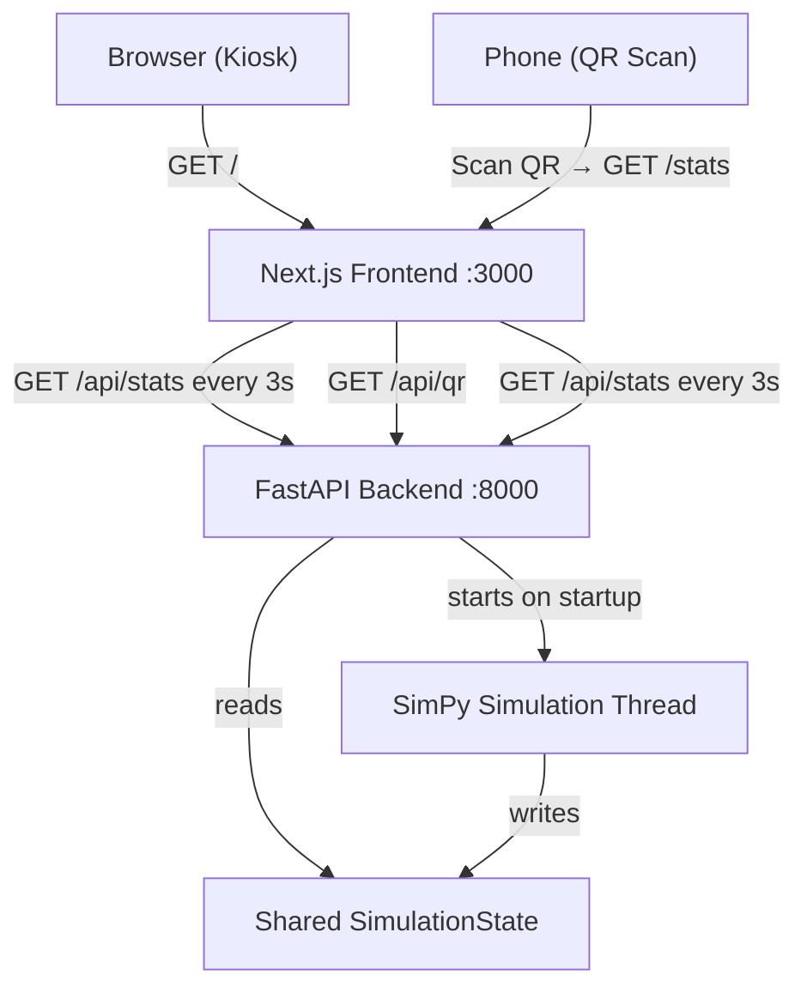

# System Architecture — Flow Diagram

```mermaid
graph TD
  Browser["Browser (Kiosk)"]
  Phone["Phone (QR Scan)"]
  Frontend["Next.js Frontend :3000"]
  Backend["FastAPI Backend :8000"]
  Sim["SimPy Simulation Thread"]
  State["Shared SimulationState"]

  Browser -->|"GET /"| Frontend
  Frontend -->|"GET /api/stats every 3s"| Backend
  Frontend -->|"GET /api/qr"| Backend
  Phone -->|"Scan QR → GET /stats"| Frontend
  Frontend -->|"GET /api/stats every 3s"| Backend
  Backend -->|reads| State
  Sim -->|writes| State
  Backend -->|starts on startup| Sim
```
