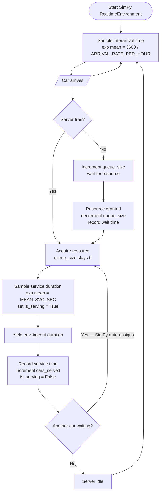

# Simulation Logic — Flowchart

M/M/1 queue: single server, Poisson arrivals (exponential interarrival), exponential service times.
Simulation time unit = real second (factor=1.0 in SimPy RealtimeEnvironment).

## Key Parameters

| Env var | Default | Meaning |
|---|---|---|
| `MEAN_IAT_SEC` | `7` | Mean interarrival time (seconds) |
| `MEAN_SVC_SEC` | `5` | Mean service time (seconds) |

With defaults: utilization ρ = 5/7 ≈ **71%**
